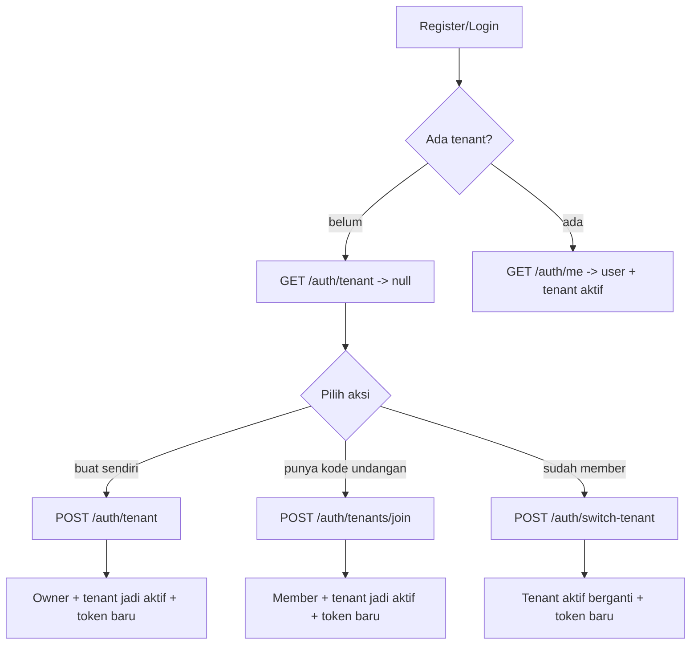

# Plan: Multi-Tenant (Workspace) untuk Auth

## Keputusan yang sudah disepakati (final)

1. **Kode undangan**: dibuat mudah & sederhana (mis. `ABCD-1234`), disimpan sebagai **hash** (sha256) — tidak plaintext. Helper crypto dirapikan ke lokasi ideal (bukan di `enc.guard.ts`).
2. **Jenis undangan**: (a) **terbuka** — siapa pun dengan kode bisa join; (b) **by email** — ditargetkan ke email tertentu, dengan status **pending / accepted / rejected** (setujui / tolak).
3. **Role** default via undangan: `member`.
4. **Login**: memilih tenant yang **terakhir dipakai** di session user; kalau tidak ada tenant sama sekali → `tenant: null` (klien memakai list/switch); kalau ada tenant → dipilihkan & bisa di-switch.

## Tujuan

User dapat mengelola beberapa workspace (tenant):

- Mulai **tanpa tenant** setelah register.
- Membuat tenant sendiri (`owner`), atau
- Bergabung ke tenant teman/keluarga lewat **kode undangan**.
- Berpindah tenant aktif (berlaku per session/device), dan
- Endpoint baru mengikuti bentuk `MeResponse = { user, tenant }`.

## Konsep kunci

- `sessions.tenantId` (uuid publicId) = tenant aktif **per session**. Sudah ada kolomnya, sekarang diisi + dipakai.
- `tenantId` juga dimuat di klaim JWT (access + refresh) sehingga tiap request tahu tenant aktif; `switch-tenant` & `create` menerbitkan token baru.
- Register/login **tidak** auto-create tenant -> `tenant` null sampai user memilih/membuat/join.

## Alur yang didukung

## Perubahan per file

### 1. `packages/db/src/schema/tenant_invites.ts` (BARU) + export

Tabel undangan join tenant.
Kolom: `id`, `publicId` uuid, `tenantId` FK -> tenants, `inviteeEmail` (opsional, null = siapa saja), `code` text unique, `role` (tenant_role, default member), `expiresAt`, `usedAt` (null = belum dipakai), `revokedAt` (null = aktif), `createdAt`.
Constraint: unique `(tenant_id, invitee_email)` saat belum terpakai (opsional) & index `tenant_id`.

- Tambah `export * from "./tenant_invites";` di `packages/db/src/schema/index.ts`.
- Generate migration `pnpm db:generate` + `pnpm db:migrate`.

### 2. `packages/shared/src/identifier.ts`

`TenantSafe` dijadikan single definition (publicId string | null, name string | null). Hapus definisi duplikat di `tenant.ts`.

### 3. `packages/shared/src/auth.ts`

- `AuthResponse` ditambah `tenant: TenantSafe` (hasil register/login).
- `MeResponse` sudah `{ user, tenant, fromCache }` (tetap).

### 4. `packages/shared/src/tenant.ts` (perbarui)

- Reuse `TenantSafe` dari identifier.
- Tambah tipe undangan: `InviteCodeResponse`, `CreateInviteDto` (expiresInHours?, role?, email?), `JoinTenantDto` (code), `TenantInfo` (role, isCurrent, createdAt), `TenantListResponse`, `TenantAuthResponse`.
- Export dari `packages/shared/src/index.ts`.

### 5. `apps/api/src/modules/auth/auth.service.ts`

- **Fix bug rotasi session**: `refreshToken` sekarang memakai helper `rotateSessionTenant` (update row di tempat: ganti `refreshTokenHash`, set `tenantId`, `lastActiveAt`, `expiresAt`, reset `revokedAt=null`) — jangan soft-revoke lalu create lagi yang meninggalkan `revoked_at` pada session aktif.
- `register`/`login`: **tanpa** auto-tenant. `createSession(user.id, null, meta)`; respons `tenant: null`.
- `getMe(userId, tenantId)`: kembalikan `{ user, tenant }` (tenant aktif dari session/klaim; null bila belum ada).
- `listTenants(userId, currentTenantId)`: join tenant_users+tenants -> `TenantInfo[]`.
- `createTenant(userId, {name})`: insert tenants + tenant_users(role owner) dalam 1 blok; jadikan tenant aktif -> terbitkan token baru (`TenantAuthResponse`).
- `switchTenant(userId, {tenantId}, currentSessionId, meta)`: cek user adalah member; update tenant aktif session -> rotasi token (`rotateSessionTenant`). Member non-owner juga boleh switch.
- `generateInvite(userId, tenantPublicId, dto)`: hanya **owner/admin** tenant. Jika `email` kosong → undangan terbuka (kode dikembalikan sekali, disimpan hash). Jika `email` diisi → undangan by email, status `pending`, kode opsional (tetap dibuat utk alternatif claim). `role` default `member`.
- `getPendingInvitesForEmail(userId)`: list undangan `pending` yang emailnya cocok dengan email user (biar invitee bisa accept/reject).
- `acceptInvite(userId, inviteId, meta)`: cek invite pending & email cocok (atau terbuka); buat membership (role dari invite), set status `accepted`, jadikan tenant aktif → token baru.
- `rejectInvite(userId, inviteId)`: set status `rejected`.
- `joinByInviteCode(userId, {code}, meta)`: undangan terbuka/by-kode → cari by hash kode, validasi aktif/belum kadaluarsa; tambah membership; status `accepted`; jadikan tenant aktif → token baru.
- `revokeInvite` (owner/admin): batalkan undangan (status `rejected`).
- Helper internal: `getLastUsedTenantForUser` (login: tenant dari session paling baru milik user yang masih valid membership), fallback `getFirstTenantForUser`, `getTenantByIdForUser` (cek membership), `getTenantByPublicId`, `isTenantOwnerOrAdmin`.
- Pertimbangan: `AuthResponse` bertambah `tenant`; periksa semua pemanggil (controller).

### 6. `apps/api/src/modules/auth/auth.controller.ts`

- `register`/`login`/`refresh` panggil service sesuai (sudah kirim meta).
- Endpoint baru (semua `@UseGuards(JwtAuthGuard)`):
  - `GET /auth/tenants` -> list
  - `GET /auth/tenant` -> tenant aktif (dari `user.tenantId`)
  - `POST /auth/tenant` -> create (body CreateTenantDto), set cookie token baru
  - `POST /auth/switch-tenant` -> switch (body SwitchTenantDto), set cookie token baru
  - `POST /auth/tenants/:tenantId/invites` -> generate invite (owner/admin)
  - `GET /auth/tenants/:tenantId/invites` -> daftar undangan tenant (owner/admin)
  - `GET /auth/invites/pending` -> undangan pending utk email user
  - `POST /auth/invites/:inviteId/accept` -> setujui + join
  - `POST /auth/invites/:inviteId/reject` -> tolak
  - `POST /auth/tenants/join` -> join undangan terbuka pakai kode
- `GET /auth/me` sekarang `getMe(user.id, user.tenantId)`.

### 7. `apps/api/src/core/strategies/jwt.strategies.ts`

- `loadUser` memakai `user:auth:{id}` (sudah). `validate` sudah menempelkan `tenantId` dari payload ke `AuthenticatedUser`. Pastikan `request.user` membawa `tenantId` non-null saat aktif (payload berisi uuid).

### 8. Tes & verifikasi

- `apps/api/src/modules/auth/auth.service.spec.ts`: mock tambah `tenants`, `tenantUsers`, `tenantInvites`, helper chaining update/insert; sesuaikan `logout(1)` -> `logout(1, sessionId)` & ekspektasi `sessionStore.remove`.
- Jalankan: `pnpm db:generate`, `pnpm db:migrate`, `pnpm build`, `pnpm --filter @finwall/api test`, `pnpm lint`.

## Catatan / keputusan

- Undangan: `code` dikirim plaintext sekali (mis. `SHORT-CODE`); disimpan di DB sebagai hash (opsional) atau plaintext, disesuaikan kebutuhan. Di sini dipilih simpan plaintext code di kolom `code` dengan index unique karena dipakai lookup user-facing; jika ingin lebih aman, hash code saat simpan & lookup by hash.
- `inviteeEmail` dibiarkan null dulu (undangan "siapa saja yang punya kode"), sederhana.
- Switch-tenant hanya untuk tenant di mana user sudah jadi member. Join via invite menambah keanggotaan.
- Tidak ada batas jumlah tenant per user di scope ini.
